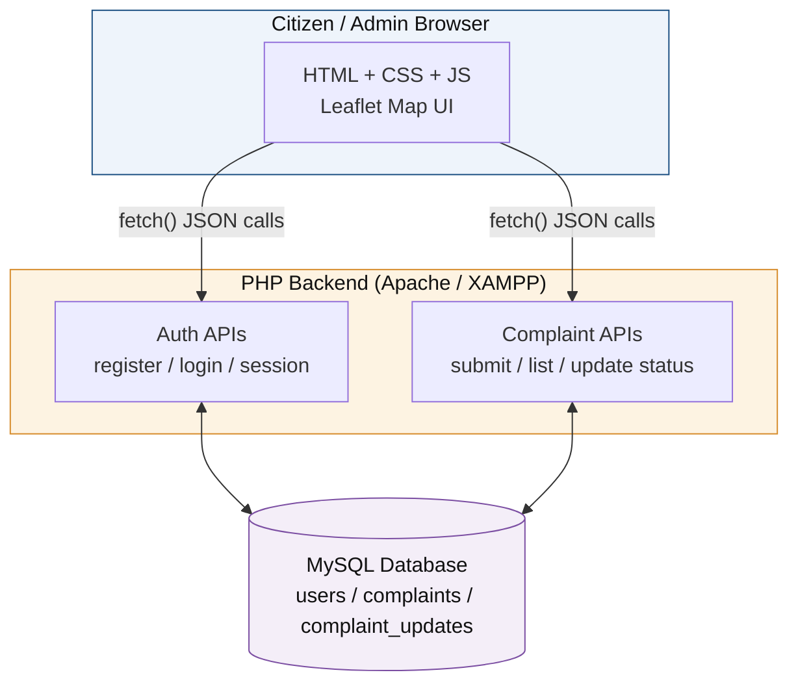
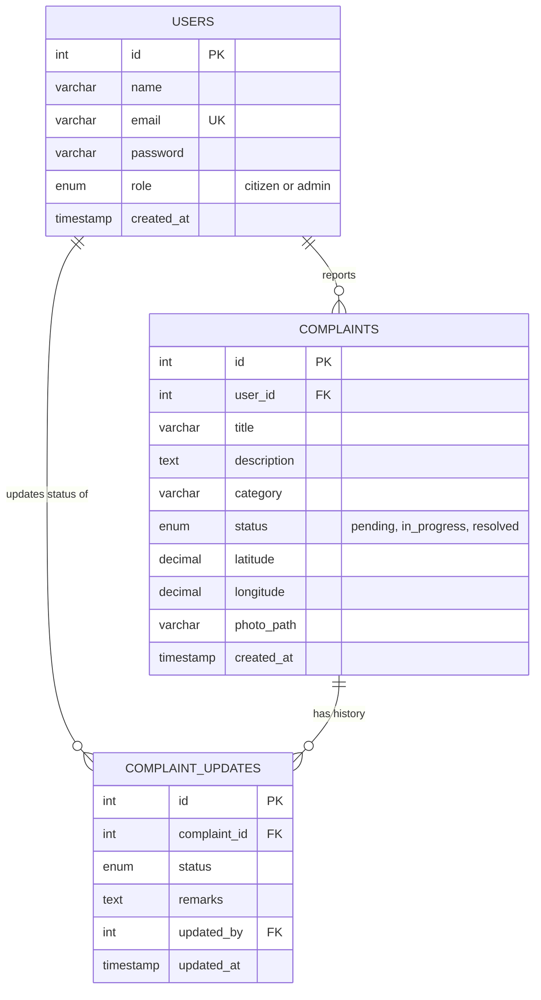
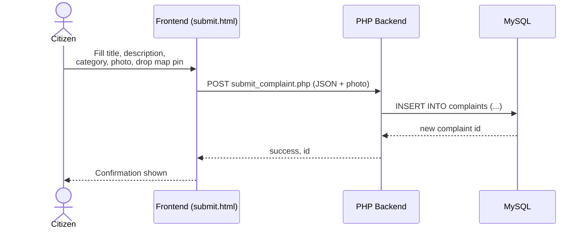
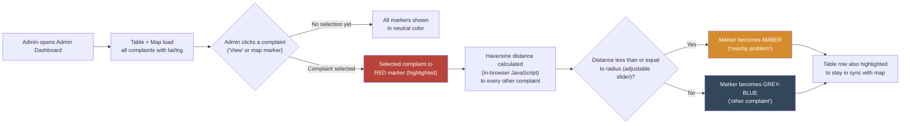

# CivicFix — Smart Civic Grievance Management System

CivicFix is a full-stack web platform that lets citizens report civic issues
— potholes, garbage pileups, broken streetlights, water problems — with a
photo and a precise map location, and lets government/admin staff track,
prioritize, and resolve them from a live map-based dashboard.

---

## Tech Stack

| Layer | Technology |
|---|---|
| Frontend | HTML5, CSS3, JavaScript (vanilla), Leaflet.js (maps) |
| Backend / API | PHP + MySQL (PDO, prepared statements, session auth) |
| Maps | OpenStreetMap tiles via Leaflet.js (no API key required) |

---

## 1. System Architecture



A simple two-tier design: the browser talks directly to the PHP API over
JSON (`fetch()` calls), and PHP talks to MySQL. No external services are
required to run the app.

---

## 2. Database (Entity-Relationship Diagram)



---

## 3. Complaint Submission Flow (Sequence)



---

## 4. Admin Dashboard — Map Highlighting Logic



This runs entirely client-side in `admin.js` — no server round-trip needed.
It lets field teams instantly see which unresolved issues are clustered near
the one they're currently working on, so they can plan an efficient route
instead of jumping across the city.

---

## 5. Setup Instructions (Local Demo with XAMPP)

### Step 1 — Database
1. Start **MySQL** in the XAMPP control panel.
2. Open phpMyAdmin → Import → select `database/schema.sql`.
   This creates the `civicfix` database with `users`, `complaints`, and
   `complaint_updates` tables.

### Step 2 — Backend (PHP)
1. Copy the `backend/` folder into `htdocs/civicfix/backend/`.
2. Check `backend/config/db.php` — default XAMPP credentials (`root` / no
   password) are already set; change if yours differ.
3. Start **Apache** in XAMPP.
4. Test: visit `http://localhost/civicfix/backend/api/check_session.php`
   → should return `{"logged_in":false}`.

### Step 3 — Frontend
1. Copy the `frontend/` folder into `htdocs/civicfix/frontend/`.
2. Visit `http://localhost/civicfix/frontend/index.html`.
3. Register two accounts to test both roles: one **Citizen**, one **Admin**.

### Startup order (every demo)
```
1. XAMPP        -> start MySQL + Apache
2. Browser      -> http://localhost/civicfix/frontend/index.html
```

---

## 6. Features

**Citizens can:**
- Register / log in
- Submit a complaint with title, description, category, photo, and
  map-pin location
- Track their own complaints with live status (pending / in progress / resolved)

**Admins can:**
- View all complaints in a table **and** on an interactive map
- Highlight any complaint on the map and instantly see nearby unresolved
  issues within an adjustable radius (color-coded markers)
- Filter by status and category, see summary stats
- Update complaint status with remarks (creates an audit history entry)

---

## 7. Project Structure

```
civicfix/
├── database/
│   └── schema.sql                 # MySQL schema (import this first)
├── backend/                       # PHP API - copy into htdocs/civicfix/backend
│   ├── config/db.php
│   └── api/
│       ├── register.php
│       ├── login.php
│       ├── logout.php
│       ├── check_session.php
│       ├── submit_complaint.php
│       ├── get_complaints.php
│       └── update_status.php
└── frontend/                      # HTML/CSS/JS
    ├── index.html                 # login / register
    ├── submit.html                # complaint form + map
    ├── dashboard.html             # citizen's own complaints
    ├── admin.html                 # admin dashboard + live map
    ├── css/style.css
    └── js/
        ├── auth.js
        ├── auth-guard.js          # session check on every protected page
        ├── submit.js
        ├── dashboard.js
        └── admin.js                # table + map + nearest-problem highlighting
```

---

## 8. Possible Extensions

- Email/SMS notification to citizens when complaint status changes
- Upvoting: let other citizens confirm an existing issue instead of filing
  a duplicate report
- Heatmap view (Leaflet heat plugin) showing complaint density across the city
- Re-introduce a Python microservice later for auto-categorization or
  duplicate detection, if you want a stronger "ML" angle for your resume
